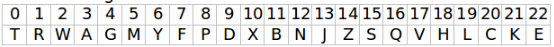

# Kata DNI

This kata is a work exposed by our teacher: (dfleta)[https://github.com/dfleta/Python_ejercicios/tree/master/Poo/DNI]

It consisted of writing a program that, given a DNI number, would obtain its NIF letter.

## Notes

- The NIF is obtained from the remainder of dividing the DNI number by 23.
- The resulting number indicates the position of the letter corresponding to that DNI in the following string:
(The letters: I, Ñ, Q, U are not used)

